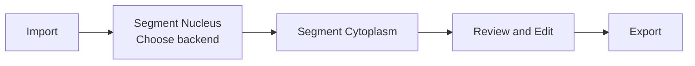

# FISH-ML: Multichannel FISH and DAPI Segmentation

FISH-ML is a unified framework for multichannel FISH and DAPI image review, segmentation, correction, and export. The current `fishGUI_multichannel` workflow is sample-based and organized around one required DAPI image plus any available cytoplasm channels for the same sample.

In the current packaged GUI, nucleus and cytoplasm segmentation are handled separately. Nucleus segmentation can use either **Cellpose-SAM** or **GroundingDINO + SAM**, depending on the selected nucleus backend. Cytoplasm segmentation currently uses **Cellpose-SAM**.

---

## Repository Structure

The main folders in this repository are organized as follows:

- `fishGUI_multichannel/`: main entry point for the multichannel GUI application
- `core/`: backend model code used by the GUI, including the Cellpose-SAM and GroundingDINO + SAM paths
- `experiments/`: notebooks for data preparation, evaluation, and prototyping
- `training/`: training utilities, training notebooks, and dataset-preparation code
- `legacy/`: older scripts and prototype code kept for reference
- `assets/icon/`: small GUI icon files included in the repository

---

## Dataset Preparation

For the current multichannel workflow, ensure that your images meet the following specifications:

- **Image dimensions:** `2048 x 2048 x 1`
- **Color space:** `16-bit grayscale`
- **Format:** `.tif`
- **Required anchor channel:** one `DAPI` image per sample
- **Optional signal channels:** any channel label that is parsed correctly from the TIFF filename and is not `DAPI`
- **Documented examples:** `647`, `488`, `555`, `594`, `514`

---

## Environment Setup

### Initial Installation

Follow these steps to set up the environment for the first time. If you have already completed the setup, please do not overwrite your existing environment and proceed to the [Running FishMultichannelUI](#running-fishmultichannelui) section.

#### Conda Installation

You can install the necessary dependencies using the provided `env.yaml` file in Anaconda. Alternatively, follow these steps:

```bash
conda create -n fish python=3.11.7
conda activate fish
pip install -r requirements.txt
```

### Model Files

The current `fishGUI_multichannel` app uses the following external model files:

#### Cellpose-SAM

The pretrained Cellpose-SAM checkpoint for the current cytoplasm workflow

- **Checkpoint:** [Google Drive Folder](https://drive.google.com/drive/folders/1PV2_K14ZOFsYIagmr0WM4Pg9eHKpSbBO?usp=sharing)
- **Path:** `assets/model/cellpose-sam/fish_cellpose_v1.pt`

#### GroundingDINO

The GroundingDINO files for nucleus center computation and nucleus prompt generation

- **Repository:** [GitHub Repository](https://github.com/IDEA-Research/GroundingDINO)
- **Checkpoint:** [Hugging Face Model](https://huggingface.co/ShilongLiu/GroundingDINO/blob/main/groundingdino_swint_ogc.pth)
- **Path:** `assets/model/groundingdino/groundingdino_swint_ogc.pth`

#### SAM Checkpoints

The `fish_v*.pth` SAM checkpoints for the `GroundingDINO + SAM` nucleus backend

- **Path:** `assets/model/sam/fish_v*.pth`

Organize the files in the root directory of the repository like this:

```text
/FISH-ML2  # Root directory
|-- /assets
|   |-- /icon
|   |   |-- brush.png
|   |   |-- eraser.png
|   |   `-- bbox.png
|-- /GroundingDINO
|-- /assets
|   |-- /icon
|   |   |-- brush.png
|   |   |-- eraser.png
|   |   `-- bbox.png
|   `-- /model
|       |-- /cellpose-sam
|       |   `-- fish_cellpose_v1.pt
|       |-- /groundingdino
|       |   `-- groundingdino_swint_ogc.pth
|       `-- /sam
|           `-- fish_v3.50.pth
|-- /core
|-- /evaluation
|-- /fishGUI_multichannel
|-- /experiments
|-- /training
|-- /legacy
|-- /img
|-- /runs
|-- README.md
|-- requirements.txt
|-- env.yaml
|-- pytest.ini
`-- config.ini
```

#### Nucleus and Cytoplasm Backends

The current GUI separates nucleus and cytoplasm segmentation. For nuclei, the GUI supports both `Cellpose-SAM` and `GroundingDINO + SAM`. The `GroundingDINO + SAM` nucleus backend remains useful because it allows the user to review, add, or adjust box prompts before sending them to SAM. This works well for DAPI nuclei because nuclei are often visually clearer. For cytoplasm, the current GUI uses `Cellpose-SAM`. In practice, cytoplasm boundaries are often less clear and more variable across channels, and the `GroundingDINO + SAM` path has given less stable results for this task.

#### Optional `segment_anything` Package for Legacy Notebooks

The direct `segment_anything` package is optional. Install it only if you want to run older prototype notebooks or legacy scripts that call the original `segment_anything` API directly. The current `fishGUI_multichannel` `GroundingDINO + SAM` backend uses the Hugging Face `transformers` SAM implementation instead.

---

## Running FishMultichannelUI

After successfully setting up the environment and installing all required dependencies, you can launch **FishGUI Multichannel** using the following steps:

```bash
# Activate the environment
conda activate fish

# Run FishGUI
python -m fishGUI_multichannel.app

```

## Current FishGUI Workflow

The current `fishGUI_multichannel` workflow is sample-based rather than file-based. Each sample is organized around one required `DAPI` image plus any available cytoplasm channels for the same sample.

## Basic Workflow



For more detailed step-by-step usage, see the user guide: [fishGUI_multichannel/docs/user-guide.md](fishGUI_multichannel/docs/user-guide.md)

For developer workflow details and product-intent notes, see: [fishGUI_multichannel/docs/workflow.md](fishGUI_multichannel/docs/workflow.md)

---

## Export Format

The current `fishGUI_multichannel` export path writes paired cytoplasm and nucleus masks for each exported cell.

When pairing data is available, export can also write an optional pairing debug PDF, but that is a side output rather than a separate main workflow step.

Each exported MATLAB cell entry can store:

- `mask`: cytoplasm or whole-cell segmentation
- `nucleus_mask`: matched DAPI nucleus segmentation for that same cell
- `pos`: exported cell position
- `size`: mask size metadata

The current export flow builds paired nucleus-to-cytoplasm matches before writing the MATLAB `Tracked` structure. It also writes filename metadata, stores the export directory name on the first entry, and can generate an optional pairing debug PDF when pairing data is available.

To also generate the optional pairing debug PDF during export when pairing data is available:

```bash
python -m fishGUI_multichannel.app --export-pairing-debug-pdf
```

---

## Notes on SAM Checkpoints

The current `fishGUI_multichannel` app loads the pretrained Cellpose-SAM checkpoint `fish_cellpose_v1.pt` for the current cytoplasm segmentation workflow. For nucleus segmentation, the packaged GUI supports either the current Cellpose-SAM backend or the `GroundingDINO + SAM` backend. The SAM checkpoints listed below are kept as historical reference for earlier experiments and for the optional nucleus workflow.

| Checkpoint        | Epochs | Images | Patch Size        | Overlap | Patches | Loss   |
| ----------------- | ------ | ------ | ----------------- | ------- | ------- | ------ |
| `fish_v1.1.pth`   | 1      | 50     | 256               | 0.5     | 11,250  | 0.89   |
| `fish_v1.100.pth` | 100    | 50     | 256               | 0.5     | 11,250  | 0.4655 |
| `fish_v2.1.pth`   | 1      | 150    | 256               | 0.5     | 33,750  | 0.63   |
| `fish_v3.50.pth`  | 50     | 150    | Whole Image Input | -       | -       | -      |

---

## Future Enhancements

We are actively improving this repository and refining the multichannel GUI workflow.

Current future work includes:

- fine-tune the current Cellpose-SAM weights on more project-specific data instead of relying only on pretrained weights
- improve nucleus-to-cytoplasm pairing quality for export

For questions about setup, assets, or required files, please contact `shizukat@uci.edu`.
For issues, feature requests, or contributions, please open an issue or submit a pull request.

## License

This project is developed under [UCI Ding Lab](https://www.ding.eng.uci.edu).
