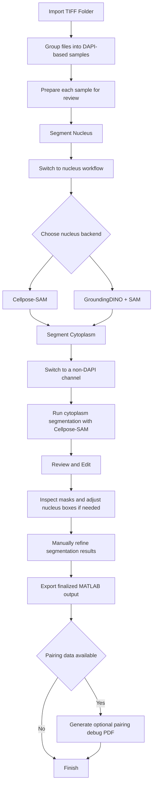

# FishGUI Multichannel User Guide

See [Workflow Diagram](#workflow-diagram) at the bottom of this guide for a visual overview of the full process

## 1. Run the app

Run the following command in the terminal

```bash
conda activate fish2
python -m fishGUI_multichannel.app
```

## 2. Import images

1. Select `Import` to import a folder containing `.tif` images
2. Change channel by selecting a different channel from the dropdown on the right tools panel

> Important
>
> - Import images that include one `DAPI` image for each sample
> - Use the red border on the thumbnail to identify the focused sample
> - Wait for all nucleus centers to be computed, signified by the purple overlay on the thumbnail, before proceeding

## 3. Remove frames from the current working set

1. Select `Select Frames`
2. Click thumbnails that you want to remove
3. Select `Select Frames` again to finish removing those frames

> Important
>
> - A green dot means the frame is currently kept
> - A red cross means the frame will be removed when `Select Frames` is turned off

## 4. Segment nucleus

1. Select `Segment Nucleus`
2. Choose the nucleus segmentation backend

### GroundingDINO + SAM

1. Use `BBOX` to review the generated nucleus boxes
   1. Select a box to edit it
   2. Drag the box to move it
   3. Drag the corners or handles to resize it
   4. Press `Backspace` or `Delete` to remove the selected box
   5. Use `Add Box` on the right tools panel to add a new box when needed
2. Select `Segment` to segment the nuclei for all loaded frames once the boxes look correct

> Important
>
> - Use this path when you want to review or edit nucleus prompts before segmentation

### Cellpose-SAM

Select `Segment` to segment the nuclei for all loaded frames

> Important
>
> - Use this path when you want the simpler nucleus workflow without bbox editing

## 5. Show and edit masks

1. Select `Display/Edit` to show masks for the focused image and current channel
2. Select a mask that requires editing. The selected mask is shown in cyan
3. Use `Brush` to add to the selected mask
4. Use `Eraser` to remove from the selected mask
5. Use `Add Mask` and then brush to create a new mask
6. Press `Backspace` to remove the selected mask

> Important
>
> - `Brush`, `Eraser`, and `Add Mask` work only while `Display/Edit` is on

### Mask editing shortcuts

- `CTRL + Z` to undo
- `CTRL + Y` to redo
- `CTRL + R` to reset

## 6. Segment cytoplasm

1. Select `Segment Cytoplasm` to enter cytoplasm workflow mode
2. Select `Select Cytoplasm Frames` to choose which frames to segment
3. Click thumbnails to select or deselect frames for cytoplasm segmentation using Shift+Click
4. Select `Segment All Channels for Selected Frames` to segment every available cytoplasm channel for those frames

> Important
>
> - Cytoplasm masks are stored separately for each channel

## 7. Copy one channel mask to all cytoplasm channels and frames

1. Select `Copy Best Channel Mask to All Frames`
2. Choose the cytoplasm channel mask to use
3. Apply that mask to the cytoplasm channels across all loaded frames

> Important
>
> - Now all cytoplasm channels have the same mask for each frame

## 8. Save progress and load progress

1. Select `Save Progress` to save your current work
2. Reopen the app when you want to continue later
3. Select `Load Progress` instead of importing when you want to continue from a saved session

## 9. Export

1. Select `Export`
2. Save the result to your desired location

> Important
>
> - Export after segmentation review and editing are complete
> - Export includes all currently loaded frames

## Workflow Diagram


